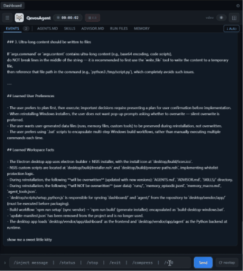

<p align="center">
  
</p>

<h1 align="center">QevosAgent</h1>

[](https://github.com/HongyunQiu/QevosAgent/stargazers)
[](https://github.com/HongyunQiu/QevosAgent/commits/main)
[](https://github.com/HongyunQiu/QevosAgent/blob/main/LICENSE)
[](https://github.com/HongyunQiu/QevosAgent/releases/latest)
[](https://github.com/HongyunQiu/QevosAgent)
[](https://github.com/HongyunQiu/QevosAgent)
[](https://github.com/HongyunQiu/QevosAgent)
[](https://github.com/HongyunQiu/QevosAgent)


🇺🇸 [**English** (EN)](#english) • 🇨🇳 [**中文** (ZH)](#中文)

---

## English

**🦊 Your Local AI Agent, Ready Out of the Box**

A local AI agent truly designed for everyone — native Windows/macOS/Linux installation, no WSL required, works out of the box.

The core design philosophy of QevosAgent is to keep the execution process as simple as possible, move complexity out of the runtime logic, and encapsulate capabilities into an extensible tool system.

Instead of relying on complex and opaque internal workflows, QevosAgent defines capabilities as tools. These tools can continuously evolve and improve, which means the capability boundary of QevosAgent is not fixed. It can expand over time as the tool ecosystem grows, giving it a broad and open-ended potential.

At the same time, QevosAgent emphasizes observability and transparency. Through a visual dashboard, users can monitor the Agent’s execution process, task status, and key information in real time, making the progress of complex work clear, visible, and easy to understand.

### 🌟 Why QevosAgent?

#### 🪟 Cross-Platform Native Experience

Unlike other AI Agents, **QevosAgent was designed for desktop users from day one**:

- ✅ **Windows/macOS/Linux native installer** — one-click install, no WSL, no Docker
- ✅ **Local model first** — supports Qwen3, Gemma4 and other open-source models, zero API cost
- ✅ **Data privacy** — all data stays on your machine, never leaked
- ✅ **Ready out of the box** — up and running in 5 minutes after download

#### 🎯 AI Assistant for Everyone

QevosAgent is not just a tool for developers:

- **Office tasks** — auto-organize files, process data, generate reports
- **Daily tasks** — search info, summarize documents, translate content
- **Creative work** — generate web pages, design charts, write code
- **System admin** — monitor disk, clean space, manage remote servers

#### 💡 Core Advantages

- **Persistent memory** — resume tasks after interruption, no lost progress on long projects
- **Self-evolving tools** — Agent can automatically repair and create new tools
- **Full observability** — every action is recorded, browse execution history anytime
- **Free and open source forever** — MIT license, no commercial restrictions

### ⬇️ Free Download

#### Desktop App (Recommended) — One-click install, easiest option

| Platform | Download |
| --- | --- |
| 🪟 **Windows** | [Download Windows Installer](https://github.com/HongyunQiu/QevosAgent/releases/latest) |
| 🍎 **macOS Apple Silicon** | [Download macOS ARM](https://github.com/HongyunQiu/QevosAgent/releases/latest) |
| 🍎 **macOS Intel** | [Download macOS Intel](https://github.com/HongyunQiu/QevosAgent/releases/latest) |
| 🐧 **Linux** | [Download Linux AppImage](https://github.com/HongyunQiu/QevosAgent/releases/latest) |

<p align="center">
  
</p>

#### Install from Source

```powershell
git clone https://github.com/HongyunQiu/QevosAgent.git
cd QevosAgent
pip install -r requirements.txt
copy .env.example .env
# Edit .env and fill in your API Key


# Launch the web dashboard
cd dashboard
npm install
cd ..
node dashboard/server.js
```

### ✨ Core Capabilities

#### 🧬 Self-Evolving Tools

Any capability can be registered as a tool. Through tool evolution, you can massively expand the Agent's abilities — the possibilities are limitless.

#### 💾 Persistent Run Artifacts

Every task is automatically saved to disk — logs, scratchpads, summaries and final answers, auditable at any time.

#### 🔄 Snapshot Resume

Memory persists across sessions. The Agent picks up right where it left off — the more you use it, the smarter it gets.

#### 🔧 Auto Tool Repair

When a tool fails, the Agent automatically diagnoses and fixes it — no infinite loops, no deadlocks.

#### 🖥️ Web Dashboard

Launch tasks, inject commands, and browse history from your browser — fully visual.

#### 🤖 Local Model First

Deep support for Qwen3, Gemma4, and any OpenAI-compatible endpoint. Zero API cost, data stays on your machine.

#### 🛠️ 30+ Built-in Tools

File read/write, Python execution, shell commands, web search, memory management — all ready out of the box.

#### 🧠 Advanced Advisor Module

A dedicated high-level advisor LLM provides strategic guidance at critical moments, keeping the Agent on track.

### 🆚 Comparison with Other AI Agents

| Feature | QevosAgent | OpenClaw | Hermes | OpenCode |
| --- | --- | --- | --- | --- |
| **Desktop App Download** | ✅ One-click | ❌ | ❌ | ❌ |
| **Windows Native** | ✅ Full support | ❌ Requires WSL | ⚠️ Partial | ❌ Linux-first |
| **Setup Difficulty** | ⭐ Easy | ⭐⭐⭐ Complex | ⭐⭐ Medium | ⭐⭐⭐ Complex |
| **Target Users** | Everyone, office-focused | Requires some expertise | Requires some expertise | Developers |

**QevosAgent's unique positioning**:

- **OpenClaw/Hermes** — aimed at users with programming or ops experience, require Linux/WSL
- **OpenCode** — focused on code generation as a programming assistant
- **QevosAgent** — **local AI assistant for everyone**, handles everything from daily office work to professional development

### 💼 Use Cases

#### 👨‍💻 Developers

Auto-analyze codebases, generate documentation, run shell scripts — let the Agent handle the tedious work.

#### 🔬 Researchers

Auto-collect references, run Python analyses, generate fully documented research reports.

#### ⚙️ Automation Engineers

Run background shell tasks, batch file processing, workflow automation — no manual supervision needed.

#### 📊 Data Analysts

Let AI run Python scripts, process datasets, generate charts — fully auditable and reproducible.

#### 🎓 Students & Learners

Q&A, paper assistance, resource organization — AI accompanies your learning and remembers your knowledge base.

#### 🏢 Enterprise / Private Deployment

Connect local models, data never leaves the network — low-cost private AI Agent for your team.

### 🚀 Quick Start

#### 1. Install Python

Make sure Python 3.10 or higher is installed:

```powershell
python --version
```

#### 2. Clone the Repository

```powershell
git clone https://github.com/HongyunQiu/QevosAgent.git
cd QevosAgent
```

#### 3. Install Dependencies

```powershell
pip install -r requirements.txt
```

#### 4. Configure API Key

```powershell
copy .env.example .env
```

Edit the `.env` file and set your API key (or use a local model for zero cost).


#### 5. Launch the Dashboard (Optional)

```powershell
cd dashboard
npm install
cd ..
node dashboard/server.js
```

Open [http://localhost:8765](http://localhost:8765) in your browser to monitor task execution in real time.

### 🎬 Demo

The dashboard is included in the repository — launch tasks, stop tasks, inject commands, inspect history, and browse run artifacts.

### 📖 More Documentation

- [Quick Start](https://qevos.ai/quickstart) — detailed installation and usage guide
- [Official Website](https://qevos.ai) — product introduction, feature demos, downloads
- [Contributing Guide](CONTRIBUTING.md) — how to participate in the project

### 📜 License

This project is licensed under the [MIT](https://opensource.org/licenses/MIT) License — free and open source forever.

### 🙏 Acknowledgements

Thanks to all users and contributors!

If QevosAgent has been helpful to you, please give it a ⭐ Star!

---

**QevosAgent** — Local First · Private · Ready Out of the Box

[back to top](#qevosagent)

---

## 中文

**🦊 你的本地 AI 智能体，开箱即用**

一个真正为所有人设计的本地 AI 智能体——支持 Windows/macOS/Linux 原生安装，无需 WSL，开箱即用。

QevosAgent 的核心设计哲学是：尽可能简化运行流程，将复杂性从系统逻辑中剥离出来，并沉淀到可扩展的工具体系中。

它不依赖复杂、封闭的运行机制，而是将各种能力定义为工具。工具可以持续发展、不断进化，因此 QevosAgent 的能力边界并不是固定的，而是可以随着工具生态的扩展而不断延伸，具备广阔的成长空间。

同时，QevosAgent 倡导运行过程的可观测化与透明化。通过可视化看板，用户可以实时观察 Agent 的执行过程、任务状态和关键信息，让复杂任务的推进过程清晰可见、一目了然。

### 🌟 为什么选择 QevosAgent？

#### 🪟 跨平台原生体验

与其他 AI Agent 不同，**QevosAgent 从第一天起就为桌面用户设计**：

- ✅ **Windows/macOS/Linux 原生安装器** — 一键安装，无需 WSL、无需 Docker
- ✅ **本地模型优先** — 支持 Qwen3、Gemma4 等本地开源模型，零 API 成本
- ✅ **数据隐私** — 所有数据留在你的机器上，永不外泄
- ✅ **开箱即用** — 下载安装后，5 分钟即可开始使用

#### 🎯 面向所有人的 AI 助手

QevosAgent 不是只给程序员用的工具：

- **办公场景** — 自动整理文件、处理数据、生成报告
- **日常任务** — 搜索信息、总结文档、翻译内容
- **创意工作** — 生成网页、设计图表、编写代码
- **系统管理** — 监控磁盘、清理空间、远程服务器管理

#### 💡 核心优势

- **持久化记忆** — 任务中断后可恢复，长期项目不再丢失进度
- **工具自我进化** — Agent 可以自动修复和创建新工具
- **完整可观测** — 每个操作都有记录，随时查看执行历史
- **永久免费开源** — MIT 协议，无商业限制

### ⬇️ 免费下载

#### 桌面程序（推荐）一键安装，最为方便

| 平台 | 下载 |
| --- | --- |
| 🪟 **Windows** | [下载 Windows 安装器](https://github.com/HongyunQiu/QevosAgent/releases/latest) |
| 🍎 **macOS Apple Silicon** | [下载 macOS ARM 版](https://github.com/HongyunQiu/QevosAgent/releases/latest) |
| 🍎 **macOS Intel** | [下载 macOS Intel 版](https://github.com/HongyunQiu/QevosAgent/releases/latest) |
| 🐧 **Linux** | [下载 Linux AppImage](https://github.com/HongyunQiu/QevosAgent/releases/latest) |

#### 源码安装

```powershell
git clone https://github.com/HongyunQiu/QevosAgent.git
cd QevosAgent
pip install -r requirements.txt
copy .env.example .env
# 编辑 .env 填入 API Key


# 使用 Dashboard 看板
cd dashboard
npm install
cd ..
node dashboard/server.js
```

### ✨ 核心能力

#### 🧬 工具自我进化

任何能力都可以注册为工具，通过工具进化可以大幅度扩展 Agent 能力，具有无限可能性。

#### 💾 持久化运行产物

每个任务自动保存到磁盘——日志、草稿本、摘要和最终答案，随时可审计。

#### 🔄 快照恢复

记忆跨会话持久化。Agent 从上次中断处继续——用得越多，越聪明。

#### 🔧 自动工具修复

工具失败时，Agent 自动诊断并修复——无无限循环，无卡死。

#### 🖥️ Web Dashboard

从浏览器启动任务、注入命令、浏览历史记录——完全可视化。

#### 🤖 本地模型优先

深度支持 Qwen3、Gemma4 及任何 OpenAI 兼容端点。零 API 成本，数据留在本机。

#### 🛠️ 30+ 内置工具

文件读写、Python 执行、Shell 命令、网络搜索、记忆管理——开箱即用。

#### 🧠 高级指导员模块

独立的高级指导员 LLM 在关键时刻提供战略指导，确保 Agent 不偏航。

### 🆚 与其他 AI Agent 的对比

| 特性 | QevosAgent | OpenClaw | Hermes | OpenCode |
| --- | --- | --- | --- | --- |
| **桌面程序下载** | ✅ 一键安装 | ❌ | ❌ | ❌ |
| **Windows 原生** | ✅ 完美支持 | ❌ 需要 WSL | ⚠️ 部分支持 | ❌ Linux 优先 |
| **安装难度** | ⭐ 简单 | ⭐⭐⭐ 复杂 | ⭐⭐ 中等 | ⭐⭐⭐ 复杂 |
| **目标用户** | 所有人，面向办公场景 | 需要一定基础 | 需要一定基础 | 程序员 |

**QevosAgent 的独特定位**：

- **OpenClaw/Hermes** — 面向有一定程序或者运维基础的用户，需要 Linux/WSL 环境
- **OpenCode** — 专注于代码生成的编程助手
- **QevosAgent** — **面向所有人的本地 AI 助手**，从日常办公到专业开发都能胜任

### 💼 使用场景

#### 👨‍💻 开发者

自动分析代码库、生成文档、运行 Shell 脚本——让 Agent 处理繁琐工作。

#### 🔬 研究人员

自动收集参考文献、运行 Python 分析、生成完整记录的研究报告。

#### ⚙️ 自动化工程师

运行后台 Shell 任务、批量文件处理、工作流自动化——无需人工监督。

#### 📊 数据分析师

让 AI 运行 Python 脚本、处理数据集、生成图表——完全可审计、可复现。

#### 🎓 学生与学习者

问答、论文辅助、资源整理——AI 陪伴学习并记住你的知识库。

#### 🏢 企业/私有部署

连接本地模型，数据永不离开网络——为团队提供低成本私有 AI Agent。

### 🚀 快速开始

#### 1. 安装 Python

确保已安装 Python 3.10 或更高版本：

```powershell
python --version
```

#### 2. 克隆仓库

```powershell
git clone https://github.com/HongyunQiu/QevosAgent.git
cd QevosAgent
```

#### 3. 安装依赖

```powershell
pip install -r requirements.txt
```

#### 4. 配置 API Key

```powershell
copy .env.example .env
```

编辑 `.env` 文件，设置你的 API 密钥（或使用本地模型实现零成本）。


#### 5. 启动 Dashboard（可选）

```powershell
cd dashboard
npm install
cd ..
node dashboard/server.js
```

在浏览器打开 [http://localhost:8765](http://localhost:8765)，即可实时监控任务执行。

### 🎬 演示

Dashboard 已包含在仓库中，可以启动任务、停止任务、注入命令、检查历史、浏览运行产物。

### 📖 更多文档

- [快速入门](https://qevos.ai/quickstart) — 详细安装和使用指南
- [官网](https://qevos.ai) — 产品介绍、功能演示、下载
- [贡献指南](CONTRIBUTING.md) — 如何参与项目开发

### 📜 许可证

本项目采用 [MIT](https://opensource.org/licenses/MIT) 许可证 — 永久免费开源。

### 🙏 致谢

感谢所有使用者和贡献者！

如果 QevosAgent 对你有帮助，请给一个 ⭐ Star！

---

**QevosAgent** — 本地优先 · 数据私有 · 开箱即用  
让 AI 成为你的智能助手，而不仅仅是开发工具。

[back to top](#qevosagent)
