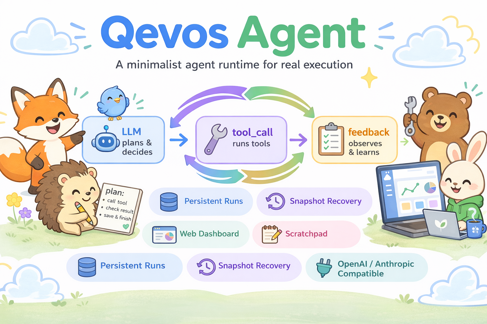

<p align="center">
  
</p>

# QevosAgent

[](https://github.com/HongyunQiu/QevosAgent/stargazers)
[](https://github.com/HongyunQiu/QevosAgent/commits/main)
[](https://github.com/HongyunQiu/QevosAgent)
[](https://github.com/HongyunQiu/QevosAgent)
[](https://github.com/HongyunQiu/QevosAgent)
[](https://github.com/HongyunQiu/QevosAgent)

`QevosAgent` is a minimalist agent runtime for real tool-calling workflows with persistent artifacts, recoverable memory, and observable execution.

`QevosAgent` 是一个极简但完整的 Agent Runtime，重点不只是“调用模型和工具”，而是把运行过程、状态恢复、工具修复和可观察性一起做完整。除了闭源模型以外，本项目还特别适合对接本地运行的开源模型，如QWEN3.5 27b,Gemma4等。实现免TOKEN成本运行。本项目还提供基于浏览器的看板，用于在浏览器中实现交互。同时提供开箱即用的可执行文件，一键安装运行，免于复杂的配置，支持WINDOWS,LINUX,MACOS。特别是在WINDOWS下也可以开箱即用，无需WSL和复杂的设置。

It keeps the core loop small: `LLM -> tool_call -> feedback -> done`.

What makes it different is everything around that loop: persistent runs, recoverable snapshots, built-in scratchpad, explicit tool repair, human intervention, and a lightweight dashboard you can actually use.

<p align="center">
  
</p>


## Why QevosAgent?

- Minimal closed-loop agent runtime
- Persistent run artifacts on disk
- Recoverable snapshot memory
- Explicit tool repair and evolution
- Built-in scratchpad for multi-step tasks
- Lightweight web dashboard
- Human intervention during execution

## Quick Start

Copy, fill in your model settings, and run:

```powershell
Copy-Item .env.example .env
python -m pip install -r requirements.txt
python run_goal.py "分析当前目录并总结问题"
```

If you want the dashboard too:

```powershell
cd dashboard
npm install
npm start
```

## Demo

The dashboard is already included in the repo, and it can launch runs, stop tasks, inject commands, inspect history, and browse run artifacts.

Dashboard screenshot / GIF: coming soon.

## What makes it different?

Many "simple agent" repos stop at:

- model call
- tool execution
- final answer

`QevosAgent` also emphasizes:

- persistent artifacts for every run
- recoverable snapshots across runs
- explicit tool repair instead of endless tool sprawl
- recovery from loop stalls and JSON parsing failures
- human intervention while the agent is running
- dashboard-based observability

This makes it more useful as a runtime you can study, debug, modify, and extend, not just a minimal demo.

## Use Cases

- Build and study a small but complete agent runtime
- Run local-model-driven autonomous tasks
- Experiment with tool evolution and repair
- Inspect persistent run artifacts for debugging
- Add a lightweight dashboard to agent workflows
- Explore scratchpad-driven multi-step execution

## Observable By Default

Every run writes artifacts to disk.

That means you do not just get a final answer. You also keep the logs, scratchpad, summaries, reflections, metadata, and large raw outputs needed to audit, replay, and debug what happened.

Typical run outputs include:

- `short_term.jsonl`
- `status.json`
- `meta.json`
- `scratchpad.md`
- `execution_summary.md`
- `reflection.md`
- `final_answer.md`
- `artifacts/` for large tool outputs

## Core Capabilities

Current tracked capabilities include:

- `OpenAI-compatible` backends via `OPENAI_BASE_URL`
- `Anthropic` backend support
- Standard tools for files, shell, Python, scratchpad, memory, snapshots, and background jobs
- Runtime `scratchpad` requirements for plan tracking and acceptance evidence
- `agent_snapshot_meta.json` snapshot recovery for memory, evolved tools, and repair candidates
- Explicit repair flow: `validate_tool_recipe -> repair_tool_candidate -> promote_tool_candidate`
- Persistent runtime outputs such as `short_term.jsonl`, `status.json`, `meta.json`, and `final_answer.md`
- User intervention commands such as `/inject`, `/stop`, `/status`, and `/+N`
- A web dashboard for launching runs, inspecting files, and editing `AGENTS.md` and snapshots
- `advisor.py` Senior Advisor module: an independent second-perspective LLM pass triggered periodically or on loop detection to provide strategic guidance without carrying main-agent context

## 仓库结构

```text
agent/
  core/
    llm.py               # LLM 后端、system prompt、响应解析
    executor.py          # 工具执行与参数过滤
    loop.py              # 主循环、自恢复、验收门禁、上下文压缩
    async_manager.py     # 后台 shell 任务管理
    compression.py       # 上下文压缩与裁剪
    advisor.py           # 独立视角的高级指导员模块
    types_def.py         # Action / ToolSpec / ToolResult / AgentState
  runtime/
    persistence.py       # 运行期落盘与 run 产物生成
    user_interrupt.py    # 命令行用户干预
  tools/
    standard.py          # 标准工具集、快照与工具演化

run_goal.py              # 命令行启动入口
dashboard/
  server.js              # Dashboard 服务端
  public/index.html      # Dashboard 前端

test/
  demo.py                # 最小示例与手动组装示例
  tests_parse_response.py
  tests_runtime_regressions.py

agent_tools.json         # 用户自定义工具持久化文件
```

## 运行模型

主循环的大致流程如下：

1. 根据工具、长期记忆和草稿本构建 system prompt
2. 将 `short_term` 组装成对话消息
3. 估算 prompt 大小，必要时压缩上下文
4. 调用 LLM，解析返回的 JSON action
5. 执行工具并把结果回灌到 `short_term`
6. 自动提炼关键信息回写 `scratchpad`
7. 在 `done` 前检查 `ACCEPTANCE` 验收块
8. 持续更新运行状态和最终产物

当前实现特别关注几类运行时问题：

- 上下文过大时自动裁剪 `short_term`
- 过大的工具输出先落盘再向模型返回预览
- 响应带前缀文本、代码块包裹、多段 JSON 时尽量鲁棒解析
- 工具重复调用进入循环时发出警告，必要时触发硬封锁和上下文重建

## 标准工具集

当前标准工具包含：

- `remember`
- `raw_append`
- `scratchpad_get`
- `scratchpad_set`
- `scratchpad_append`
- `think`
- `run_python`
- `shell`
- `web_search`
- `write_file`
- `read_file`
- `read_file_lines`
- `file_outline`
- `grep_files`
- `analyze_content`
- `edit_file`
- `set_goal`
- `ask_user`
- `append_episodic`
- `search_episodic`
- `save_concept`
- `read_concept`
- `save_tools`
- `load_tools`
- `validate_tool_recipe`
- `repair_tool_candidate`
- `promote_tool_candidate`
- `register_tool`
- `delete_tool`
- `shell_bg`
- `job_wait`
- `job_cancel`
- `jobs_list`

其中 `register_tool` 用于新增工具，`repair_tool_candidate` 和 `promote_tool_candidate` 用于修复已有工具而不是无限注册同义新工具。

## Installation

### Python dependencies

```powershell
python -m pip install -r requirements.txt
```

The current `requirements.txt` stays intentionally small:

- `openai`
- `anthropic`
- `tiktoken`

### Dashboard dependencies

If you want the web dashboard, install the Node-side dependencies too:

```powershell
cd dashboard
npm install
```

The dashboard requires Node.js 18 or later.

## Configuration

The project includes `.env.example`, and `run_goal.py` automatically attempts to load `.env` from the current directory.

The most commonly used environment variables are:

- `OPENAI_PROFILE`
- `OPENAI_PROFILE_OSS120B_BASE_URL`
- `OPENAI_PROFILE_QWEN3527DGX_BASE_URL`
- `OPENAI_BASE_URL`
- `OPENAI_MODEL`
- `OPENAI_API_KEY`
- `MAX_ITERS`
- `RUNS_DIR`
- `AGENT_SNAPSHOT`
- `AUTO_REMEMBER_ON_DONE`
- `AUTO_SAVE_SNAPSHOT_ON_EXIT`

Useful defaults to know:

- If `OPENAI_BASE_URL` is not set, the launcher tries to derive it from `OPENAI_PROFILE`
- On startup it probes the model service; if only one model is returned, it auto-selects that model as `OPENAI_MODEL`
- `AUTO_REMEMBER_ON_DONE=1` and `AUTO_SAVE_SNAPSHOT_ON_EXIT=1` are enabled by default
- The default snapshot file is the repo-root `agent_snapshot_meta.json`

## Running from CLI

### 1. Prepare `.env`

Create `.env` in the repo root and fill in at least your model endpoint and API key. `.env.example` is the starting point.

### 2. Run a task

```powershell
python run_goal.py "分析当前目录并总结问题"
```

`run_goal.py` does a few useful things automatically:

- loads `.env`
- probes the model service
- creates `runs/<timestamp>/` for the current run
- sets `RUN_DIR` and the default `RAW_MEMORY_PATH`
- loads the snapshot first when `agent_snapshot_meta.json` exists
- injects repo-root `AGENTS.md` when present
- saves the snapshot again on exit

### 3. Human intervention during execution

In CLI mode, you can type these commands while the agent is running:

- `/help`
- `/stop`
- `/exit`
- `/inject <消息>`
- `/compress [N]`
- `/status`
- `/log [N]`
- `/+N` 形式的迭代扩容命令，例如 `/+50`

These commands are handled by [`agent/runtime/user_interrupt.py`](./agent/runtime/user_interrupt.py).

## Dashboard

Start it with:

```powershell
cd dashboard
npm start
```

The default address is `http://localhost:8765`. You can customize it with:

- `DASHBOARD_PORT`
- `RUNS_DIR`
- `AGENT_DIR`
- `POLL_MS`
- `PYTHON_CMD`

The current dashboard supports:

- launching a new `run_goal.py` task
- stopping a running task
- injecting `/inject` and related commands into a live run
- viewing current status and run history
- browsing files for a specific run
- viewing and editing repo-root `AGENTS.md`
- viewing and editing `agent_snapshot_meta.json`

## Run Artifacts

Each run creates a directory under `runs/<timestamp>/`. The current persistence flow writes files such as:

- `short_term.jsonl`
- `meta.json`
- `status.json`
- `scratchpad.md`
- `final_answer.md`
- `execution_summary.md`
- `issues.json`
- `reflection.md`

If a tool output is too large, the main loop writes the raw content into `artifacts/` so the result is preserved instead of being lost to context trimming.

## Snapshot Mechanism

The default snapshot file is the repo-root `agent_snapshot_meta.json`.

The snapshot currently stores:

- `long_term`
- `evolved_tools`
- `tool_repair_candidates`
- `tool_repair_failures`
- `tool_repair_history`
- `scratchpad`

By default, loading restores long-term memory, promoted evolved tools, and repair candidates. It does not directly restore old scratchpad content, which helps avoid carrying stale intermediate state into a new task.

User-defined tools registered via `register_tool` are persisted in `agent_tools.json` at the repo root and are automatically loaded on the next run.

## Use as a Library

### Simplest usage

```python
from agent import Agent

agent = Agent(
    backend="openai",
    api_key="local",
    max_iterations=20,
    verbose=True,
)

state = agent.run("帮我分析一个目录结构")
print(state.meta.get("final_answer"))
```

### Add a custom tool

```python
from agent import Agent
from agent.core.types_def import ToolSpec, ToolResult

def to_upper(state, text: str) -> ToolResult:
    return ToolResult(success=True, output=text.upper())

agent = Agent(verbose=False)
agent.add_tool(
    ToolSpec(
        name="to_upper",
        description="把输入文本转成大写",
        args_schema={"text": "输入文本"},
        fn=to_upper,
    )
)
```

### Lower-level assembly

```python
from agent.core.loop import run, console_hooks
from agent.core.llm import OpenAIBackend
from agent.tools.standard import get_standard_tools

llm = OpenAIBackend(api_key="local", base_url="http://localhost:8000/v1")
state = run(
    goal="完成一个任务",
    llm=llm,
    tools=get_standard_tools(),
    hooks=console_hooks(),
    max_iterations=10,
)
```

For more examples, see [`test/demo.py`](./test/demo.py).

## Tests

The repository currently includes two directly runnable test entry points:

```powershell
python test/tests_parse_response.py
python test/tests_runtime_regressions.py
```

Coverage focuses on:

- response parsing robustness
- snapshot restoration and invalid evolved tool filtering
- tool repair flows
- acceptance evidence parsing
- `run_goal.py` environment defaults and service probing
- runtime persistence

## Scope and Boundaries

`QevosAgent` is not trying to be everything.

It is not a fully sandboxed platform.
It is not a production-grade multi-user orchestration system.
It is not yet a fully packaged PyPI framework.

What it is: a compact but complete runtime you can study, run, inspect, modify, and extend.

Current practical boundaries include:

- dependency management is still based on `requirements.txt`
- `shell` and `run_python` are intentionally powerful and are not sandboxed further
- acceptance checks validate evidence shape, not semantic correctness
- long-term memory is currently a lightweight string-list design, not a full retrieval system
- the dashboard is intentionally lightweight, not a full multi-tenant control plane

## Key Files

- [`run_goal.py`](./run_goal.py)
- [`agent/core/loop.py`](./agent/core/loop.py)
- [`agent/core/advisor.py`](./agent/core/advisor.py)
- [`agent/tools/standard.py`](./agent/tools/standard.py)
- [`agent/runtime/persistence.py`](./agent/runtime/persistence.py)
- [`dashboard/server.js`](./dashboard/server.js)
